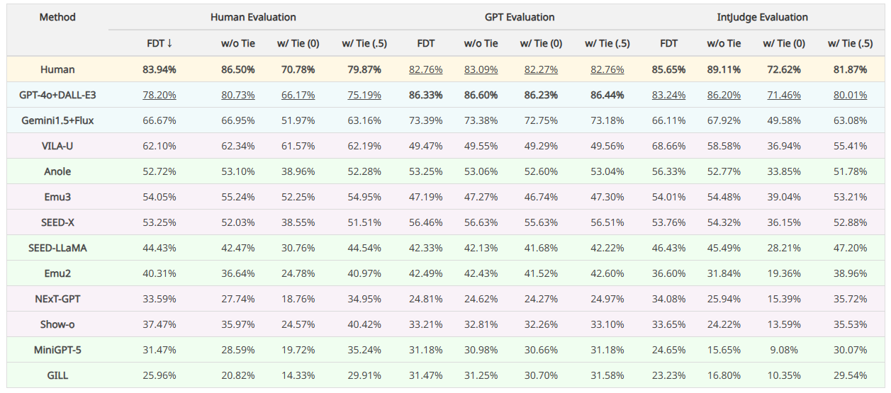

# OpenING

[**🚀 Quickstart**](https://github.com/LanceZPF/OpenING?tab=readme-ov-file#-quick-start) | [**🌐 Homepage**](https://opening-benchmark.github.io/) | [**🏆 Leaderboard**](https://opening-benchmark.github.io/#leaderboard) | [**🤗 IntJudge**](https://huggingface.co/IntJudge/IntJudge) | [**📖 OpenING arXiv**](https://arxiv.org/pdf/2411.18499) | [**🖊️ Citation**](https://github.com/LanceZPF/OpenING?tab=readme-ov-file#%EF%B8%8F-citation) 

This repository is the official implementation of [OpenING](https://arxiv.org/pdf/2411.18499) (CVPR 2025 Oral).

> [OpenING: A Comprehensive Benchmark for Judging Open-ended Interleaved Image-Text Generation](https://arxiv.org/abs/2411.18499)  
> Pengfei Zhou*, Xiaopeng Peng*, Jiajun Song, Chuanhao Li, Zhaopan Xu, Yue Yang, Ziyao Guo, Hao Zhang, Yuqi Lin, Yefei He, Lirui Zhao, Shuo Liu, Tianhua Li, Yuxuan Xie, Xiaojun Chang, Yu Qiao, Wenqi Shao, Kaipeng Zhang†
> <sup>\*</sup> Equal Contribution  
> <sup>†</sup> Corresponding Author: zhangkaipeng@pjlab.org.cn

## 💡 News

- `2025/02/27`: The beta version of OpenING data can be accessed via [Google Drive](https://drive.google.com/file/d/1Mp0VRBVjxJyX4pn5h8pD7NDlaS829ghr/view?usp=sharing). If you have any questions, please [contact us](https://github.com/LanceZPF/OpenING?tab=readme-ov-file#contact).
- `2025/02/26`: Our paper is accepted by CVPR 2025, and selected as Oral. Thanks to all contributors.
- `2024/11/29`: Our judge model [IntJudge](https://huggingface.co/IntJudge/IntJudge) is released!
- `2024/11/28`: We are releasing the evaluation code here.
- `2024/11/27`: The technical report of [OpenING](https://arxiv.org/abs/2411.18499) is released! And check our [project page](https://opening-benchmark.github.io)!

## 📖 Introduction
We introduce OpenING, a comprehensive benchmark comprising <b>5,400</b> high-quality human-annotated instances across <b>56</b> real-world tasks. OpenING covers diverse daily scenarios such as travel guide, design, and brainstorming, offering a robust platform for challenging interleaved generation methods. In addition, we present IntJudge, a judge model for evaluating open-ended multimodal generation methods. Trained with a novel data pipeline, our IntJudge achieves an agreement rate of <b>82.42%</b> with human judgments, outperforming GPT-based evaluators by <b>11.34%</b>. Extensive experiments on OpenING reveal that current interleaved generation methods still have substantial room for improvement. Key findings on interleaved image-text generation are further presented to guide the development of next-generation generative models. We anticipate that more advanced multimodal judge models can be trained and tested on OpenING and we also believe that OpenING will push the boundaries of MLLMs towards general-purpose multimodal intelligence.


## 🏆 Leaderboard

- An overview of model win rates evaluated by human, GPT-4o, and our IntJudge under FDT and different tie metrics. FDT: Force Dividing Tie metric. w/o Tie: Non-tie case. w/ Tie (0) and w/ Tie (.5): Count a tie as 0 and 0.5 wins for a model in a pairwise comparison, respectively. The best-performing model in each category is in-bold, and the second best is underlined.


Please refer to [this](https://opening-benchmark.github.io/#leaderboard) to view the dynamic leaderboard.

Besides the pairwise evaluation, our work also provide a GPT-based subjective evaluation tool for the convenience of rapid research and testing, here is the results"


## 🚀 Quick Start

Please refer to [this](Quickstart.md) to quick start.

## 🌟 Disclaimers
The guidelines for the annotators emphasized strict compliance with copyright and licensing rules from the initial data source, specifically avoiding materials from websites that forbid copying and redistribution. 
Should you encounter any data samples potentially breaching the copyright or licensing regulations of any site, please feel free to [contact us](https://github.com/LanceZPF/OpenING?tab=readme-ov-file#contact). Upon verification, we will immediately remove the potentially breaching samples.

## 📞 Contact
- Pengfei Zhou: zpf4wp@outlook.com
- Kaipeng Zhang: zhangkaipeng@pjlab.org.cn

## 🖊️ Citation 
If you feel OpenING useful in your project or research, please kindly use the following BibTeX entry to cite our paper. Thanks!
```bibtex
@inproceedings{zhou2025opening,
  title={OpenING: A Comprehensive Benchmark for Judging Open-ended Interleaved Image-Text Generation},
  author={Zhou, Pengfei and Peng, Xiaopeng and Song, Jiajun and Li, Chuanhao and Xu, Zhaopan and Yang, Yue and Guo, Ziyao and Zhang, Hao and Lin, Yuqi and He, Yefei and others},
  booktitle={Proceedings of the Computer Vision and Pattern Recognition Conference},
  pages={56--66},
  year={2025}
}